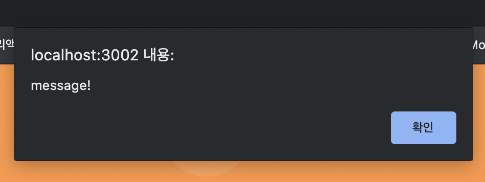
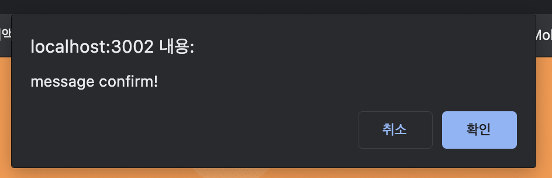
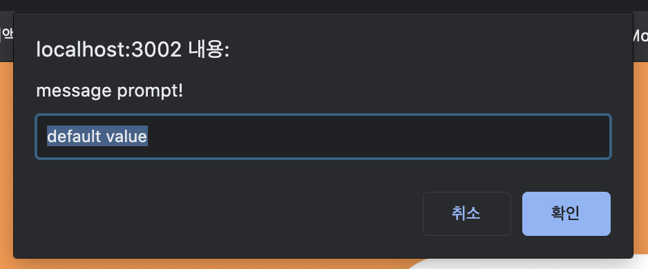

## 자바스크립트의 대화 상자 3가지
  - Alert, Confirm, Prompt

### 1. Alert

- 단순한 메세지 전달의 대화상자를 여는 함수로, 반환하는 값이 따로 없다.

  ```js
    alert( 'message!' );
  ```



### 2. Confirm

- 확인, 취소 버튼 클릭에 따라 true, false 값을 반환한다.

  ```js
    const result = confirm('message confirm!');

    // click confirm
    console.log(result) // true

    // click cancel
    console.log(result) // false
  ```



### 3. Prompt

- 입력창이 들어가있는 형태로, 입력값을 반환한다. (기본값을 넣을 수 있음.)
  ```js
    const result = prompt('message confirm!', 'default value');

    // input value
    console.log(result) // default value
  ```



